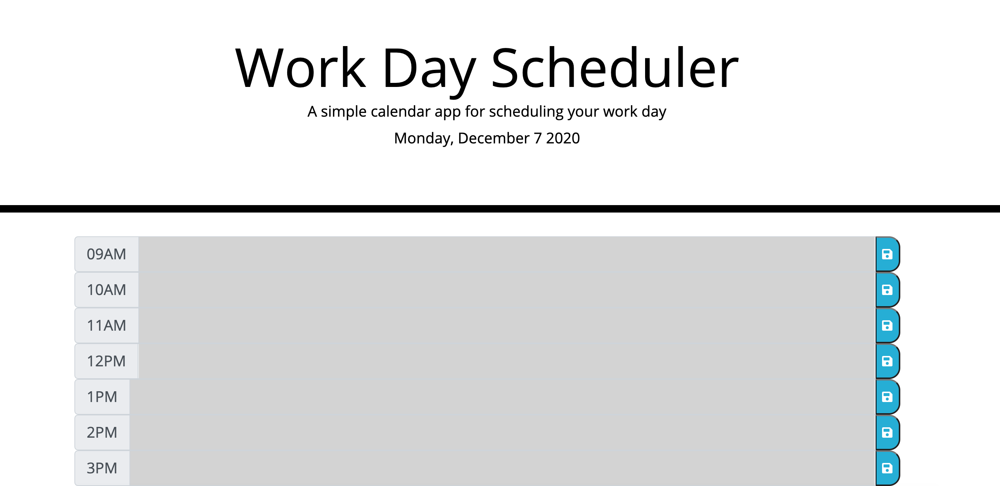
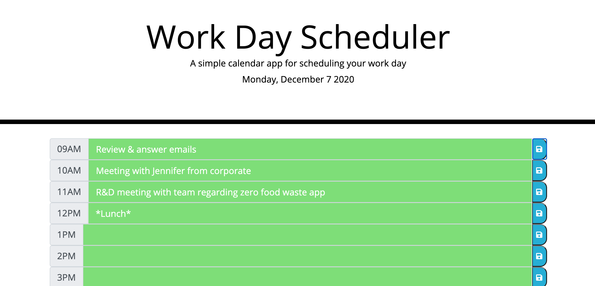

Meredith Jones Day Planner 
Created with Javascript

In this project, I created a day planner designed for tracking tasks to be done during a user's work day. 

When the page loads, the current date is displayed at the top of the planner. 

For easy visual reference, the planner is color coded, so that once an event is in the past, the time block where it is recorded will turn grey- white as seen in the screenshot below, showing the planner viewed in the late evening with all events being in the past.

Events in the current hour will have a red background, and future events will display in green blocks. 
Below is a screenshot example of the planner if it were to be viewed at in the morning before 9am with some entries for the day displaying. 

Additionally, the planner will store inputs in local storage if a user presses the corresponding "Save" button located to the far right of each block of time. Inputs will be retained even if the page is refreshed, or the user leaves the page and returns to it. 

For the date formating, I utilized dayjs and for the "save" icons on the time blocks, I used fontawesome. 

This project definitely presented some complexity relating to looping through the times assigned to each block and comparing them to the present time, as well as in the process of storing and retrieving user inputs to local storage. Those two pieces of the project took the vast majority of my time. I am happy with the functionality and how much it looks like the given goal for appearance. 